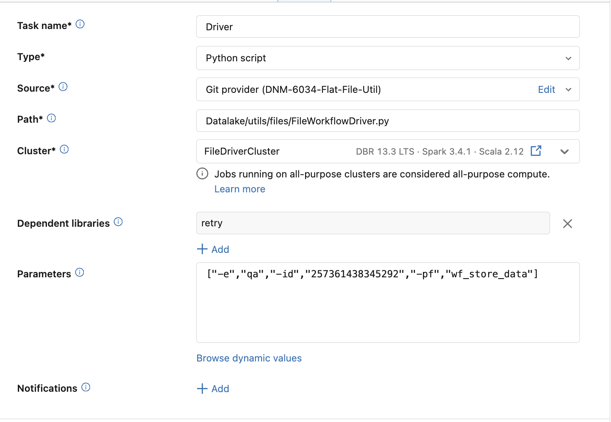
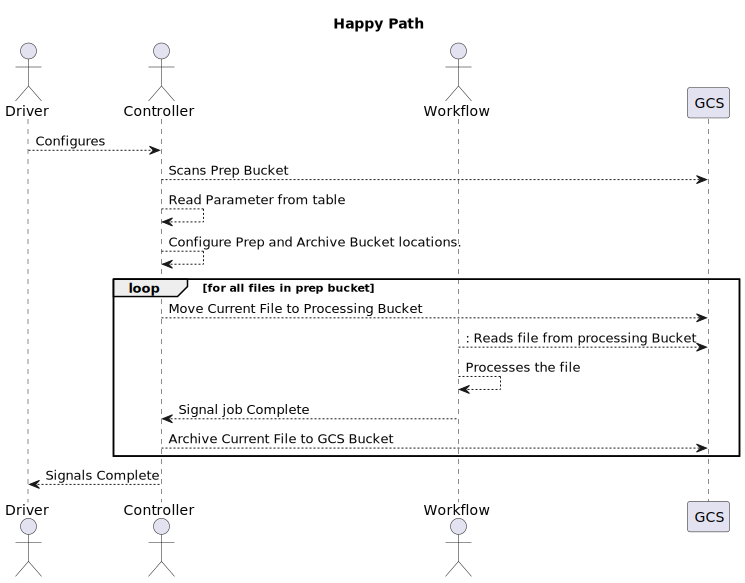
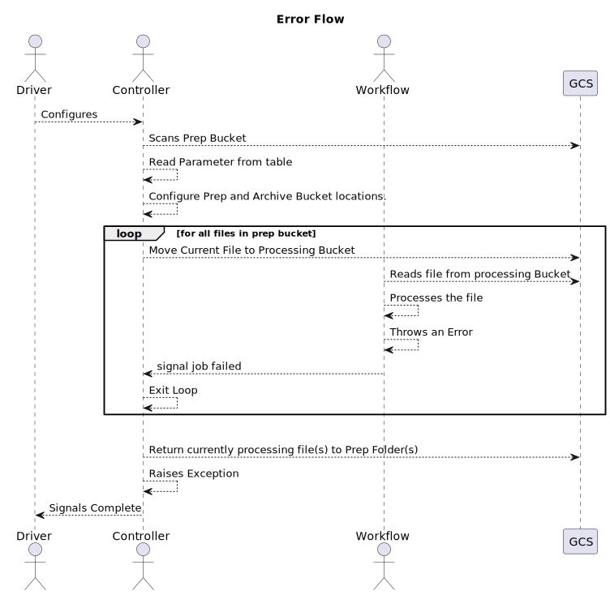

##TLDR;

The FileworkflowController and Driver are used to create a file based workflow that will process all the files that have been configured by entries in the parameter table. 

##Longer Description

The FileworkflowController should be used to handle and drive workflow(s) that are configured to read from 1 or more files.

|Key Terms| Description|
|---|----|
|`source_bucket` | This is the bucket where files are stored for processing for a particular mapping|
|`processing` directory | This is the directory in the `source_bucket` where currently processing file is moved to for processing for a particular mapping. There should only ever be one such directory in the `source_bucket` directory. There should also never be more than one file in the dirrectory.d
|`archive_bucket` | This is the bucket where files are move to post processing for for long term storage. The format of the archive path is `{archive_bucket}/{file_date}/{file}`|


Steps to configure:
1) Create parameter file scripts and execute them
```python 
from Datalake.utils.genericUtilities import insert_param_config
# set up the parameters 
# the schema for the the parameter table
raw = "raw"

# give the parameter file a name
#by rule it should be the name of the workflow 
parameter_file_name = "wf_store_data"

# give the parameter file a section for
# by rule the section should be the name of the mapping
parameter_section = "m_store_data"

# give the parameter a key for the 
# source bucket parameter
parameter_key = "source_bucket"

# the value of the parameter
parameter_value = "gs://petm-bdpl-qa-prep-p1-gcs-gbl/nas/masterdata/store_data"

# DO NOT Execute this script twice which will create the duplicates and the workflow will fail
insert_param_config(
    raw, parameter_file_name, parameter_section, parameter_key, parameter_value
)

# the second parameter key and value
parameter_key = "archive_bucket"
parameter_value = "gs://petm-bdpl-qa-raw-p1-gcs-gbl/nas/masterdata/store_data/"

insert_param_config(
    raw, parameter_file_name, parameter_section, parameter_key, parameter_value
)
```

2) Create the workfllow driver


| Name | Description |
| ---- | ----------- |
|Task Name | Provide the name of the driver task. Usually just `driver` unless you have multple file drivers to configure. |
| type|always should be set to PythonScript |
| source | Set it to either the Repo or the workspace location to pull the scripts | 
|path| Should always be set to `Datalake/utils/files/FileWorkflowDriver.py`|
| cluster | This is just a driver and should always be set to a single node cluster. prefer to use general compute with 16gb ram and 2-4 cores|
| Dependent Libraries| use retry from pypi that is the only lib needed to run the driver |

#Parameter flags
| parmeter name | short flag | long flag | description |
| ------------- | ---------- | --------- | ----------- |
| Environment | `-e `| `--environment` | sets the environment should be set to `dev`,`qa`,`prod`|
|ID| `-id`|`--job_id`| this it the id of the workflow that should be invoked|
| Parameter File Name | `-pf`| `--paramter_file`| This is the name of the parameter file where the configurations for the driver are stored.|
| **Optonal** Time Out|`-to`| `--timeout`| this is uesed to set the default time out for the workflow call. syntax is is based on days, hours and mintues and is encoded as like this example `3d5h19m` would set the timeout to 3 Days, 5 hours and 19 minutes. the default value is set to `2h` |

3) Deploy the workflow as normal, making sure to note the Job ID and inputting it into the Job ID value in the driver configuration.

## General Flow
All file are are processed in the `processing` dircetory under the `source_bucket` directory
Files are moved to the `archive_bucket`

### Happy Path Diagram


### Error Handling Flow
