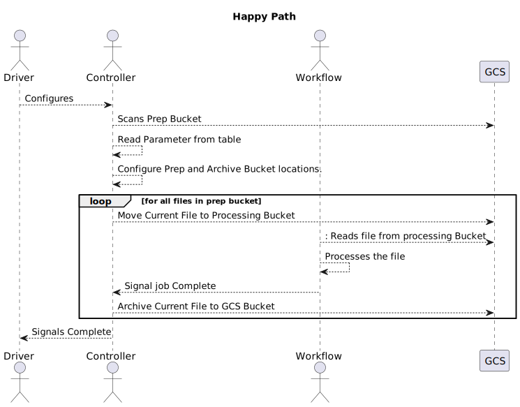

##TLDR;

The FileworkflowController and Driver are used to create a file based workflow that will process all the files that have been configured by entries in the parameter table. 

##Longer Description

|Key Terms| Description|
|---|----|
|`parameters`| Pre configured values stored in the parameter table and accessd by the `controller`|
|`controller`| The FileWorkflowController Component|
|`source_bucket` | This is the bucket where files are stored for processing for a particular mapping|
|`processing` directory | This is the directory in the `source_bucket` where the currently processing file is moved to for processing. There should only ever be one such directory in the `source_bucket` directory. There should also never be more than one file in the dirrectory. directory structure: `{source_buck}/processing`|
|`archive_bucket` | This is the bucket where files are move to post processing for for long term storage. The format of the archive path is: `{archive_bucket}/{file_date}/{file}`|
|`file(s)`| The files that are locate in the `source_bucket`|
|`date_map`| a mapping of day(s) to `file(s)` that need to processed.|
|`queue`| This is the processing list of ordered dates that need to be processed.|
|`date`| This is the current date for files that are being processed. 

The FileworkflowController should be used to handle and drive workflows that are configured to read from one or more files. The controller reads the `parameters` from the parameter table to get the `source_bucket(s)` and `archive_bucket(s)` to be used for the mappings. The controller then scans all of the `source_bucket(s)` to build a `date_map`

The `date_map` contains all of the dates that have files that need to be processed i.e. `date_map(date)->[files]|None`. The `controller` then uses the `date_map` to build a `queue` of dates that need to proceesed from the keys.

The controller then loops through the `queue` pulling the the date that should be processed. The files are then pulled from the `date_map` like `date_map(date)->[files]`. 

The `controller` then checks to make sure that for the `date` that all of the buckets have a file for processing. If there is gap then the controller will fail with a missing file exception. 

The controller then moves the files from `date_map(date)->[files]` to the `processing` directory(s). It then signals the job via dbr sdk to start processing. If the job completes normally then the `controller` moves the files that have been processed to their `archive_bucket(s)`. 

If the job fails or is terminated before completion, then all of the files currently in `processing` are moved back their `source_bucket(s)` for re-processing.

Steps to configure:
1) Create parameter file scripts and execute them
```python 
from Datalake.utils.genericUtilities import insert_param_config
# set up the parameters 
# the schema for the the parameter table
raw = "raw"

# give the parameter file a name
#by rule it should be the name of the workflow 
parameter_file_name = "wf_store_data"

# give the parameter file a section for
# by rule the section should be the name of the mapping
parameter_section = "m_store_data"

# give the parameter a key for the 
# source bucket parameter
parameter_key = "source_bucket"

# the value of the parameter
parameter_value = "gs://petm-bdpl-qa-prep-p1-gcs-gbl/nas/masterdata/store_data"

# DO NOT Execute this script twice which will create the duplicates and the workflow will fail
insert_param_config(
    raw, parameter_file_name, parameter_section, parameter_key, parameter_value
)

# the second parameter key and value
parameter_key = "archive_bucket"
parameter_value = "gs://petm-bdpl-qa-raw-p1-gcs-gbl/nas/masterdata/store_data/"

insert_param_config(
    raw, parameter_file_name, parameter_section, parameter_key, parameter_value
)
```

2) Create the workfllow driver


| Name | Description |
| ---- | ----------- |
|Task Name | Provide the name of the driver task. Usually just `driver` unless you have multple file drivers to configure. |
| type|always should be set to PythonScript |
| source | Set it to either the Repo or the workspace location to pull the scripts | 
|path| Should always be set to `Datalake/utils/files/FileWorkflowDriver.py`|
| cluster | This is just a driver and should always be set to a single node cluster. prefer to use general compute with 16gb ram and 2-4 cores|
| Dependent Libraries| use retry from pypi that is the only lib needed to run the driver |

#Parameter flags
| parmeter name | short flag | long flag | description |
| ------------- | ---------- | --------- | ----------- |
| Environment | `-e `| `--environment` | sets the environment should be set to `dev`,`qa`,`prod`|
|ID| `-id`|`--job_id`| this it the id of the workflow that should be invoked|
| Parameter File Name | `-pf`| `--paramter_file`| This is the name of the parameter file where the configurations for the driver are stored.|
| **Optonal** Time Out|`-to`| `--timeout`| this is uesed to set the default time out for the workflow call. syntax is is based on days, hours and mintues and is encoded as like this example `3d5h19m` would set the timeout to 3 Days, 5 hours and 19 minutes. the default value is set to `2h` |

3) Deploy the workflow as normal, making sure to note the Job ID and inputting it into the Job ID value in the driver configuration.

## General Flow
All file are are processed in the `processing` dircetory under the `source_bucket` directory
Files are moved to the `archive_bucket`

### Happy Path Diagram


### Error Handling Flow
